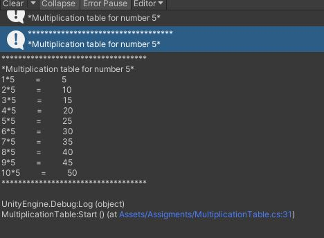
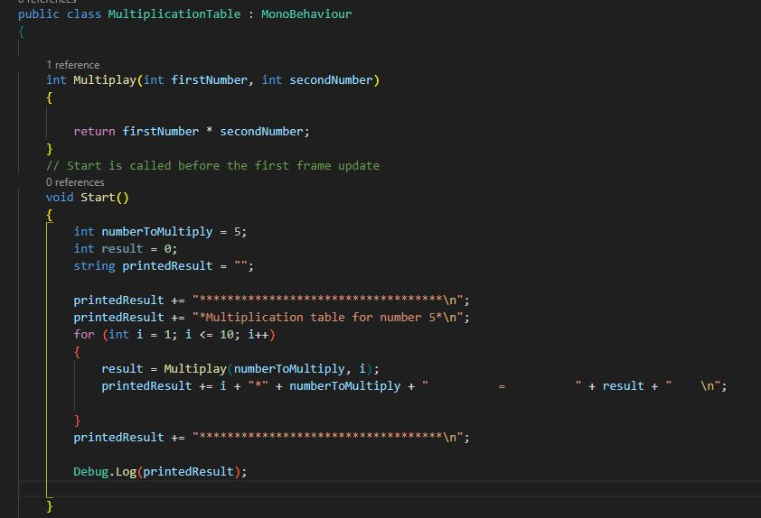
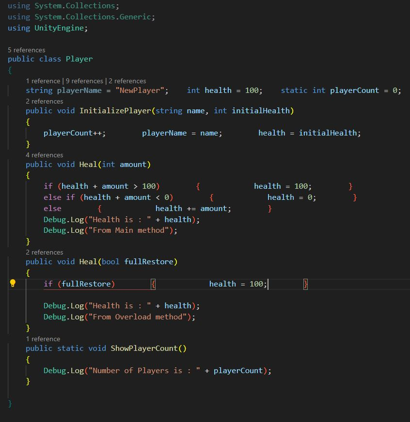
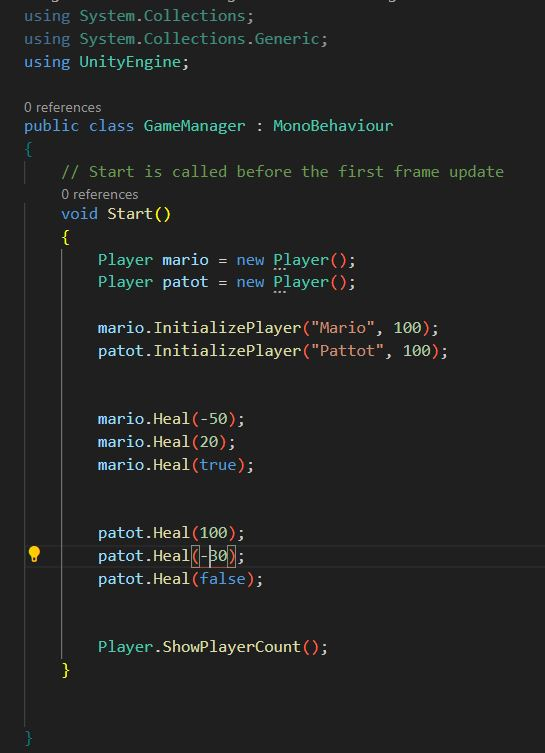
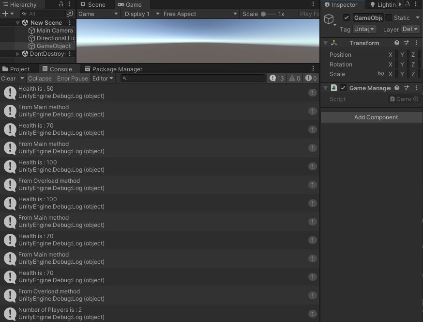
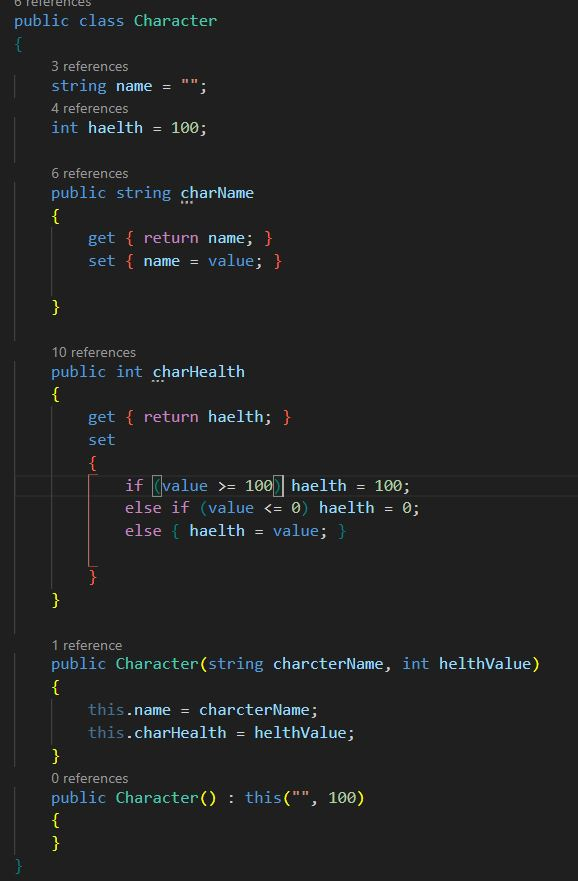
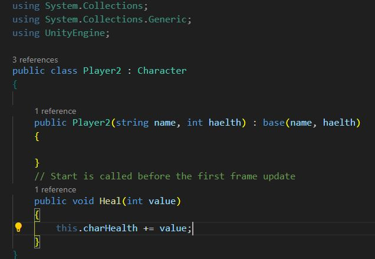
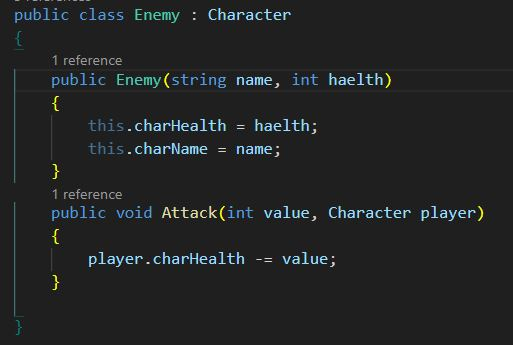
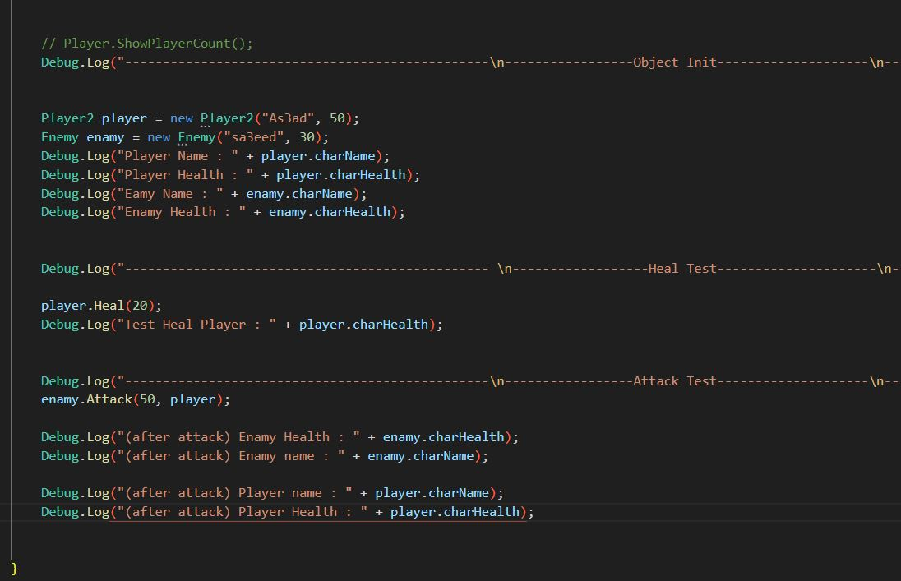

## Assigment Number 10 : 
#### Create a Multiplication Table for 5 (from 1 to 10)

- result 

- solution 

## Assigment Number 13 : 
#### Basic Programming in C# - Create the Player Class

- Player Class  

- GameManager Class  

- OutPut  

## Assigment Number 14 : 
#### Basic Programming in C# - Create the Player Class

- Character Class  

- Player2 Class  

- Enamy Class  

- GameManeger   

- Output    

