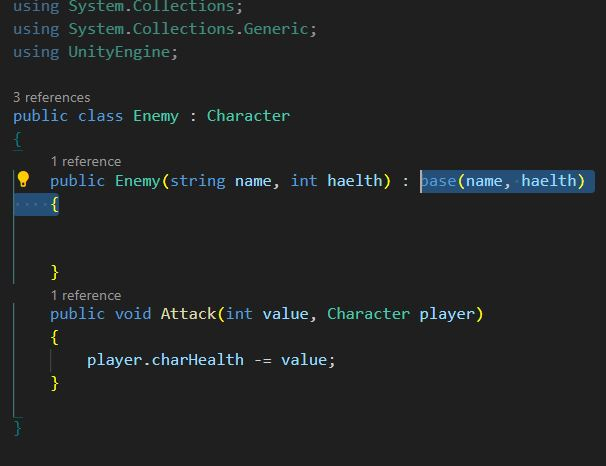

## Assigment Number 10 : 
#### Create a Multiplication Table for 5 (from 1 to 10)

- result 

- solution 

## Assigment Number 13 : 
#### Basic Programming in C# - Create the Player Class

- Player Class  

- GameManager Class  

- OutPut  

## Assigment Number 14 : 
#### Basic Programming in C# - Create the Player Class

- Character Class  

- Player2 Class  

- Enamy Class  

- GameManeger   

- Output    

## Assigment 24 Enum

## Assigment 26 Interfaces in C#

## Assigment 27 Call by Value and Call by Reference in C#

## Assigment 29 

#### Part 5: Exception Handling

#### Part 6: Unity Lifecycle and Object Interaction

