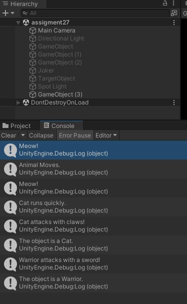

## Assigment Number 10 : 
#### Create a Multiplication Table for 5 (from 1 to 10)

- result 

- solution 

## Assigment Number 13 : 
#### Basic Programming in C# - Create the Player Class

- Player Class  

- GameManager Class  

- OutPut  

## Assigment Number 14 : 
#### Basic Programming in C# - Create the Player Class

- Character Class  

- Player2 Class  

- Enamy Class  

- GameManeger   

- Output    

## Assigment 24 Enum

## Assigment 26 Interfaces in C#

## Assigment 27 Call by Value and Call by Reference in C#

#

## Assigment 29 

#### Part 1:
Objective: Practice foundational C# concepts (var, ternary operators, string
interpolation, and System.DateTime).

#### Part 2:Custom Class Requirements

#### Part 3: Static Classes and Extension Methods

#### Part 4: Type Casting

#### Part 5: Exception Handling

#### Part 6: Unity Lifecycle and Object Interaction

#### Part 7: Recursion

## ---------------------------------------------------------------------
## Assigment 35 

### Part 1: Boxing and Unboxing in C#
Objective:
Integrate boxing and unboxing into a Unity script BoxingUnboxing to understand
how value types are converted to reference types and back.

### Part 3: Action, Func, and Predicate Delegates in C#
Objective:
Learn how to use built-in generic delegates in C# (Action, Func, and Predicate) to simplify
method handling and delegate creation.

### Part 4: Sorting a List<int> in Reverse Order Using List.Sort with CompareTo and a Lambda Expression
Objective:
Sort a list of integers in descending order using List.Sort with a lambda
expression and verify the results by printing the sorted list in one line.

### Part 5: Using List.FindAll in C#
Objective:
Learn how to use the List.FindAll method to filter elements in a list based on
a specified condition.

### Part 7: Method Chaining in Unity
Objective:
Learn how to implement and use method chaining in Unity by creating methods that return the
current instance of the class (this), enabling chained method calls.

